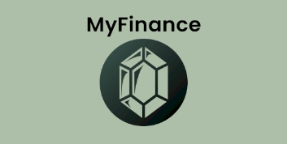
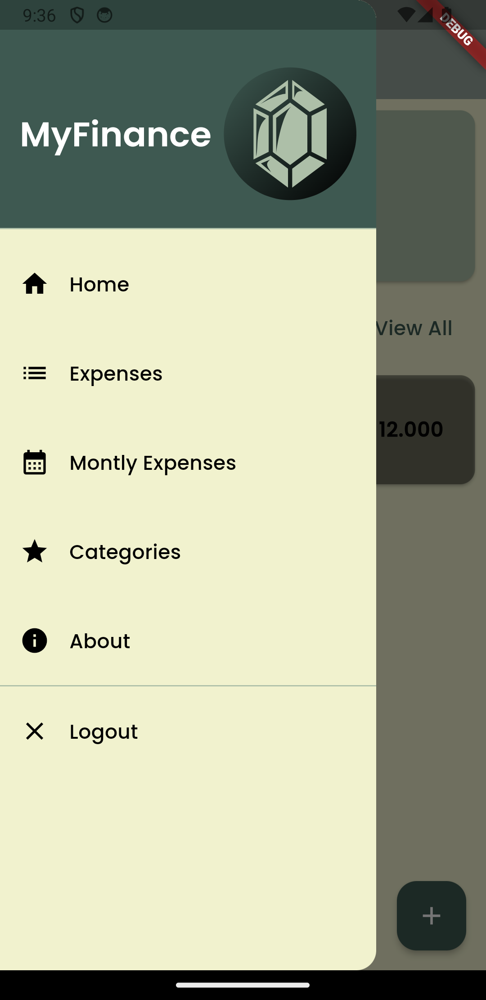
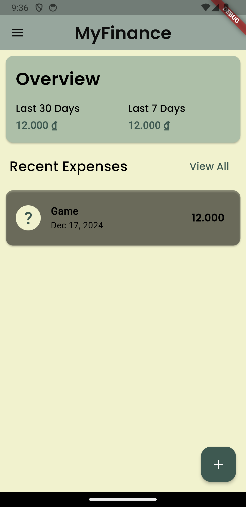
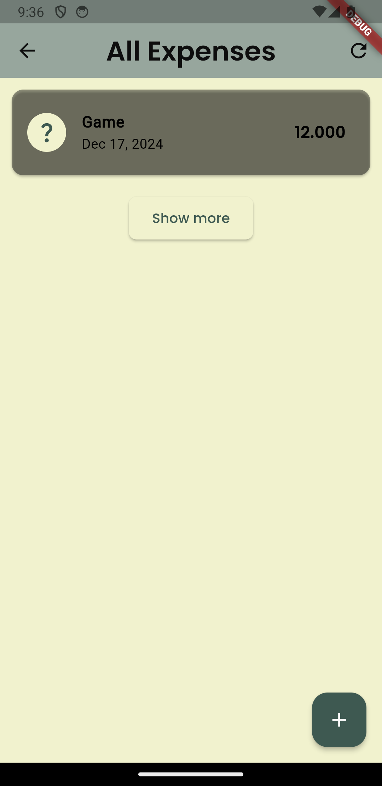
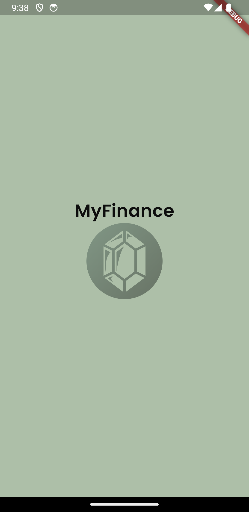

# MyFinance App (Pre-alpha)

MyFinance App is a self-hosted Flutter-based application designed to work with [MyFinanceBackend](https://github.com/sonnguyen9800/MyFinance_Backend). The app is a expense tracker app. Used for scenarios of multiple users (multiple accounts) and the the usecase is for small family.

**Warning:** The app is still under ongoing development, multiple features are still being added. Please be patient and check back for updates.

## Features

The app currently supports the following features:

* CRUD Expense
* Signin/Signup
* Category CRUD
* Assign expense to Category Group
* Viewing last expenses

## Some Images
 
 
 

## Roadmap

The app is still under development and we promise to update more features in the future, including:
* Graph and Chart (Statistics)
* Family Management
* Budget Management
* Income and Saving Management

## Getting Started

- Download the apk file and install
- Select the backend server url
- Signin or Signup
- Enjoy!

## Acknowledgements

- [Flutter](https://flutter.dev/)
- The icon of the app is created by game-icons.net (*Rupee* icon by **Delapouite** under *CC BY 3.0*)
- font-awesome-flutter
- Windsurf Editor